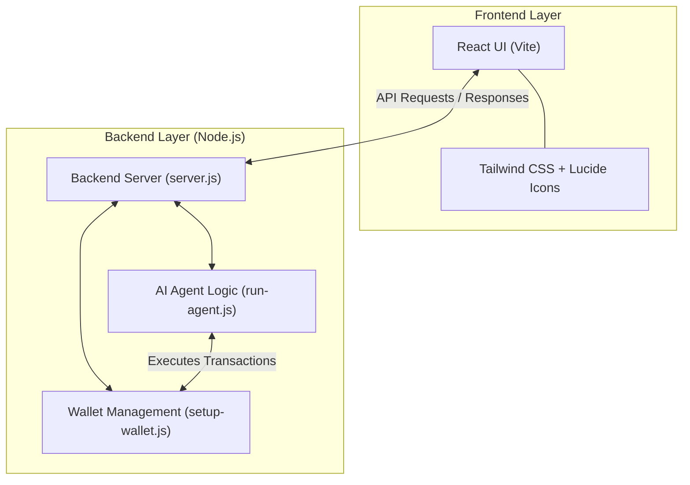

# AgenticPayments

AgenticPayments is an automated, AI-driven payment system that uses agents to manage wallets and execute transactions. 

## Structure

The repository contains:
- A root-level configuration with npm scripts to launch the application.
- `agentic-payments-ui`: A Vite + React application providing the user interface, styled with TailwindCSS.
- `backend`: A Node.js backend integrated with the UI, which manages the AI agents and handles wallet setups and transactions.

## Getting Started

1. Navigate to the root directory.
2. The project provides root-level scripts that proxy to the `agentic-payments-ui` workspace.

### Available Scripts

Run the following commands from the **root directory**:

- `npm run dev` - Starts the Vite development server for the UI.
- `npm run backend` - Starts the backend server (`server.js`).
- `npm run wallet:setup` - Runs the script to set up the wallet (`setup-wallet.js`).
- `npm run agent` - Runs the AI agent script (`run-agent.js`).
- `npm start` - Executes the `run.bat` file to start the entire stack.

Alternatively, you can navigate directly into `agentic-payments-ui` and install dependencies:

```bash
cd agentic-payments-ui
npm install
```

## Technologies Used
- **Frontend**: React, Vite, Tailwind CSS, Lucide React
- **Backend**: Node.js

### App Architecture

